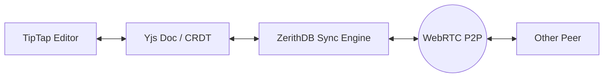

# 📝 ZerithDB Collaborative Editor Example

This example demonstrates a real-time, collaborative rich-text editor built with **ZerithDB** and
**TipTap**.

## ✨ Features

- **Real-time Sync**: Edits are propagated instantly to all connected peers using P2P WebRTC.
- **Conflict-Free**: Powered by Yjs CRDTs, ensuring no merge conflicts even with simultaneous edits.
- **Collaborative Cursors**: See where other users are typing in real-time.
- **Local-First**: Works offline and syncs automatically when back online.
- **No Server Required**: Uses ZerithDB's built-in P2P sync engine.

## 🚀 How to Run

1.  Install dependencies:
    ```bash
    pnpm install
    ```
2.  Start the development server:
    ```bash
    pnpm dev
    ```
3.  Open the link in two different browser tabs (or different browsers).
4.  Start typing! You'll see your changes and cursor reflected in the other tab instantly.

## 🧠 How it Works

The architecture follows a simple flow:

1.  **TipTap Editor**: Handles the rich-text editing experience in the browser.
2.  **Yjs**: Acts as the shared data structure (CRDT) that manages document state and conflict
    resolution.
3.  **ZerithDB Sync**: ZerithDB manages the Yjs document internally. When you make a change,
    ZerithDB's sync engine detects it and broadcasts the binary delta to peers via WebRTC.
4.  **Awareness**: Cursor positions and user info are shared via the Yjs Awareness protocol, which
    ZerithDB also propagates across the network.

### Data Flow Diagram



## 🛠 Implementation Details

- **`useZerithDoc.ts`**: A custom hook that initializes ZerithDB and retrieves the internal `Y.Doc`
  and `Awareness` provider.
- **`Editor.tsx`**: Integrates TipTap with the `Collaboration` and `CollaborationCursor` extensions.
- **`App.tsx`**: The main UI that displays the editor, peer count, and sync status.

## 📈 Extension Ideas

- Add support for multiple documents/rooms.
- Implement user authentication to show real names/avatars.
- Add image upload support.
- Persist the document to a decentralized storage layer.
